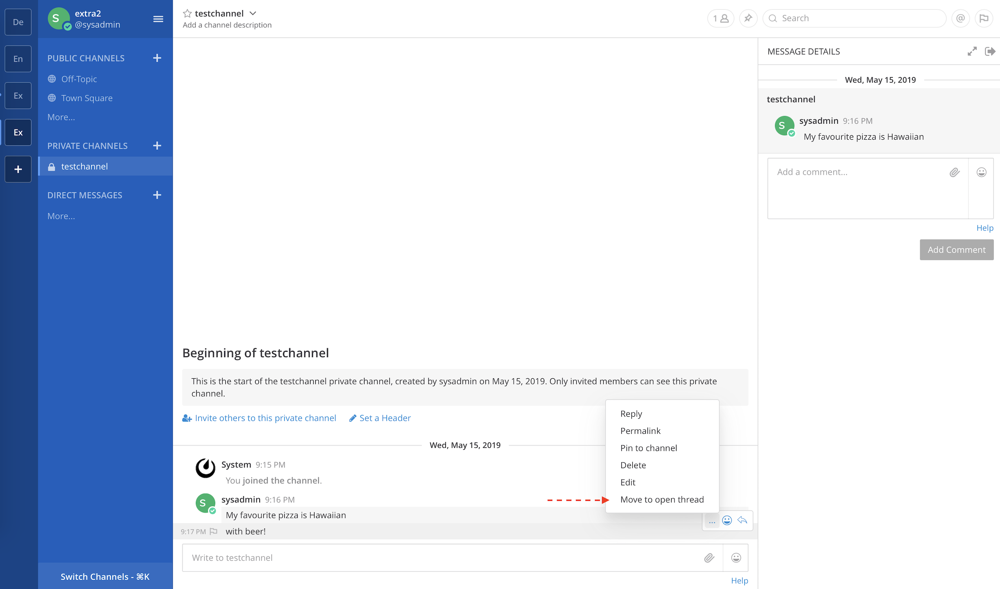
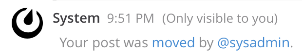

Move Post Plugin
---

Move a Mattermost post to the currently open thread. 




## Features

* Move to a thread in the same channel.
* Move to a thread in a different channel on the same team.
* **Team Edition**: move your own posts.
* **Enterprise Edition**: Move others' posts with the combination of `Edit Others' Posts` and `Delete Others' Posts` permissions to the given channel(s).

## Further details

Moving another user's post will trigger an ephemeral post visible only to the original poster with a permalink to the new location of their post and the username of the mover, for example:



The new post will have a custom type value `custom_moved_post_dest` and contain the props `mover_id` and `origin_post_id`.

## Current limitations

* Cannot move a post with attachments (coming soon)
* Cannot move a post that is already in a thread

## Development setup

1) Install [jq](https://stedolan.github.io/jq/)
2) `cd webapp/ && npm i`

## Building the plugin

```bash
make bundle
```

## Development watchers

```bash
MM_ADMIN_USERNAME=sysadmin \
MM_ADMIN_PASSWORD=test123 \
make watch-server
```

```bash
MM_ADMIN_USERNAME=sysadmin \
MM_ADMIN_PASSWORD=test123 \
make watch-webapp
```

## TODO

- [ ] Cleanup the hastily-written code
- [ ] Add tests
- [ ] Conditionally hide menu items that aren't able to be used on mobile view
- [ ] Add ability to move a post to another team
- [ ] Add a UX that also works on mobile web view
